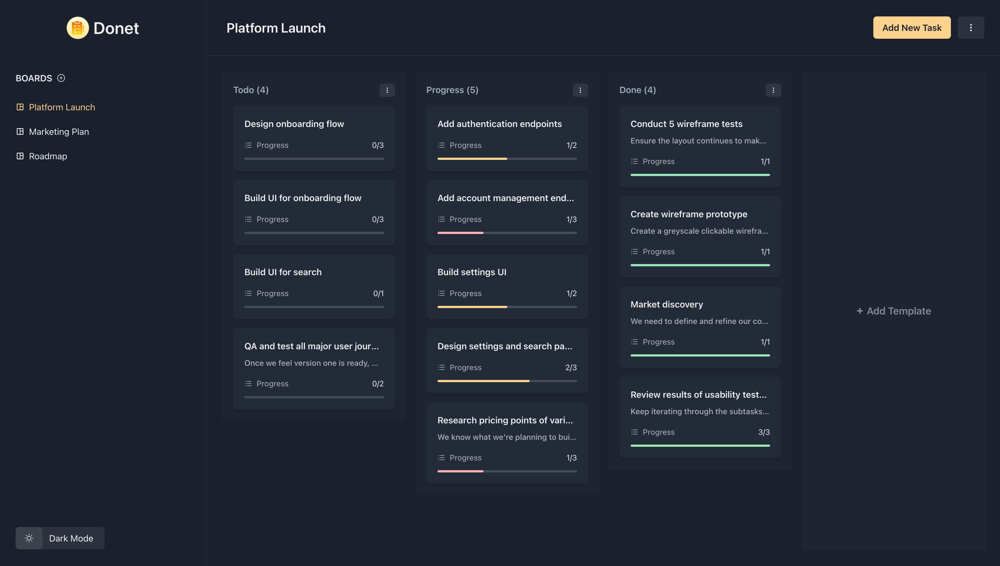

# Donet

A full-stack task management app built with React & Supabase.

## Table of contents

- [Introduction](#introduction)
- [Features](#features)
- [How does it work?](#how-does-it-work)
- [Demo](#demo)
- [Technologies](#technologies)
- [Technical Highlights](#technical-highlights)
- [Author](#author)

## Introduction

Donet is a full-stack task management application designed to help you keep your tasks organized and accessible in one place. Built with modern web technologies, it provides an intuitive interface for managing boards, templates, and tasks with drag-and-drop functionality.

## Features

- Authentication with Supabase.
- CRUD your boards, templates and tasks.
- Drag and drop.
- Light/Dark mode.
- Responsive Design.

## How does it work?

1. Login or register an account if you don't have one.
2. Once you've logged in to the app, create your first board.
3. Within this board, you can create templates, which are the columns that will be used to group your tasks.
4. Create your first task, a task can contain the following fields: title, description, subtasks, and the template it will belong to.
5. Click on your task to display a full summary of it and to access the options to modify it.
6. Drag and drop your tasks between templates at your convenience.
7. Once you have completed a task, you can delete it, just as you can do with your templates and boards.

## Demo

Here is the link to the working app: https://donet.vercel.app/

## Technologies

- [Vite](https://vitejs.dev/) - Frontend tool to set up a development environment for frameworks like React.
- [Supabase](https://supabase.com/) - The open source Firebase alternative designed to help developers spin up their backend.
- [Chakra UI](https://chakra-ui.com/) - Simple, modular and accessible component library that gives you the building blocks you need to build your React applications.
- [React Router](https://reactrouter.com/en/main/) - The standard library for client-side routing in React.
- [React Beautiful DND](https://github.com/atlassian/react-beautiful-dnd) - Beautiful and accessible drag and drop for lists with React.
- [React Hook Form](https://react-hook-form.com/) - Performant, flexible and extensible forms with easy-to-use validation.
- [Zod](https://zod.dev/) - TypeScript-first schema validation with static type inference.
- [React Query](https://tanstack.com/query/v4/) - Powerful asynchronous state management for TS/JS, React, Solid, Vue and Svelte.

## Technical Highlights

- **Optimistic Updates**: Implemented optimistic updates with React Query to maintain proper task ordering during drag-and-drop operations. This ensures instant UI updates while syncing with the backend asynchronously.
- **Backend Integration**: Leverages Supabase for backend services including database schemas, security rules, and authentication tokens, providing a robust full-stack solution.
- **Component Library**: Built with Chakra UI, a customizable component library based on a design system that accelerates development and ensures consistent styling.
- **State Management**: Uses React Query for simplified data fetching, error handling, caching, and server state management throughout the application.

## Author

Developed by Ricky Liang.

Repository: https://github.com/rickyliang5/TaskManagement.git
